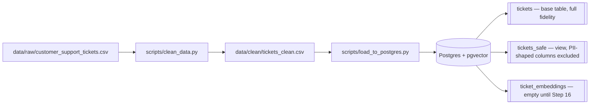
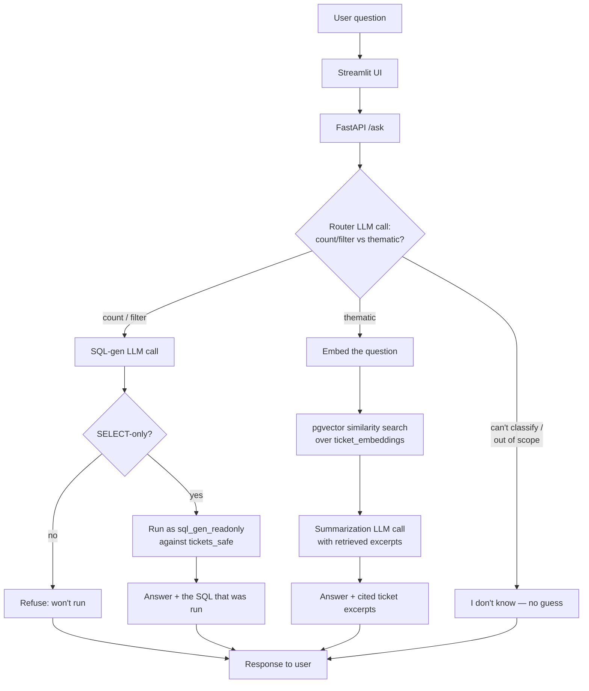

# Architecture

## 1. Offline data pipeline — built (Step 13)

`tickets_safe` is a Postgres view, not a separate copy of the data — it's derived live
from `tickets` on every query.

## 2. Online query flow — router → text-to-SQL / RAG (Steps 14-17, not built yet)

### Why two LLM calls minimum, not one
The router's only job is classification (cheap, fast, small model candidate — see Step 9).
Branch-specific generation (SQL or summary) is a separate call so each can use a
purpose-built system prompt (the SQL-gen prompt carries the `tickets_safe` schema and the
"no valid duration from first_response_time/time_to_resolution" caveat from
`data-notes.md`; the RAG prompt carries citation instructions) rather than one prompt
trying to do both jobs adequately.

### Where each guardrail from Step 3/4/11 lives in this diagram
- **No mutation, no PII to the LLM:** enforced by Postgres itself — `sql_gen_readonly` can
  only `SELECT` on `tickets_safe`, which excludes all four PII-shaped columns (verified in
  Step 13; a subagent audit caught and we fixed a version that only excluded two of four).
- **SQL-gen can't run anything but SELECT:** double-enforced — the DB role has no
  write grants at all, and the app layer also rejects non-SELECT statements before
  executing, so a bug in one layer doesn't remove the other.
- **No fabricated answers:** the router has an explicit third path (out of
  scope/unanswerable → "I don't know") rather than only two branches — a question that
  doesn't fit either handler must be refused, not forced into the nearest-fitting one.
- **Sources always shown:** SQL branch returns the query it ran; RAG branch returns which
  tickets it drew from — both required by the Step 3 must-haves.
